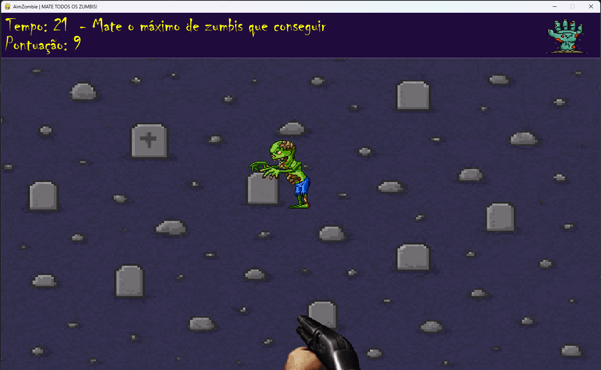
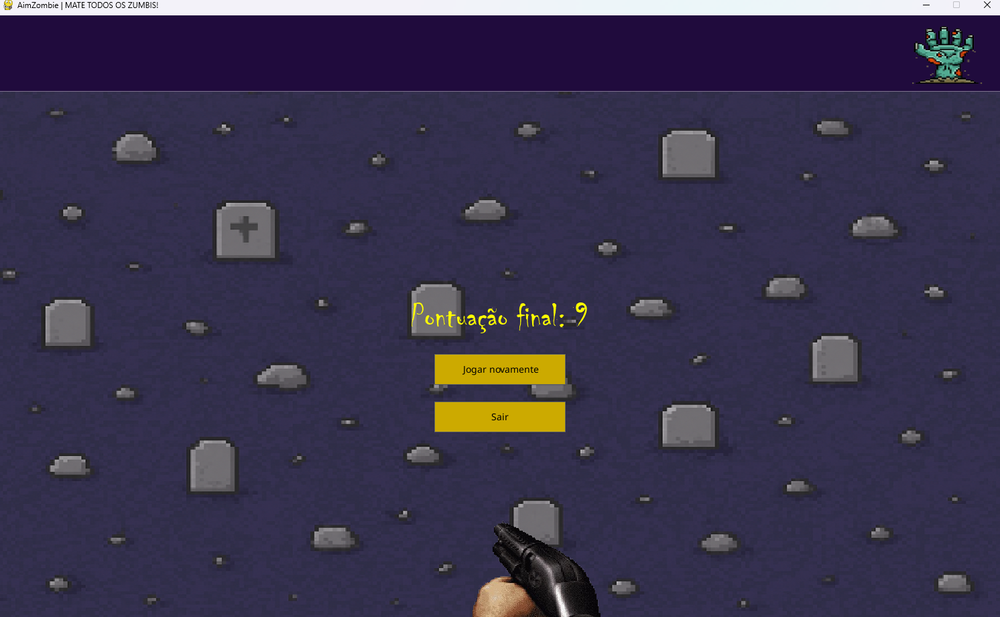

# AimZombie

AimZombie é um jogo simples em Python usando Pygame e Pygame_GUI. O objetivo é atirar nos zumbis que aparecem na tela em um tempo de 30 segundos. No final, o jogador visualiza a pontuação obtida e pode optar por jogar novamente ou sair.

## Tecnologias Usadas

- Python 3.10.7  
- pygame-ce 2.5.4  
- pygame_gui 0.6.14  
- python-i18n 0.3.9

## Como rodar o jogo

Para jogar AimZombie, siga os passos abaixo:

1. Certifique-se de ter o Python 3.10.7 instalado.  
2. Clone ou baixe este repositório.  
3. Instale as dependências necessárias executando no terminal e rode o arquivo main:  
   -> pip install -r requirements.txt
   -> python main.py

## Screenshots

   
## Roadmap

Aqui estão algumas ideias para futuras melhorias e funcionalidades no AimZombie:

- Adicionar diferentes tipos de zumbis com comportamentos variados
- Implementar sistema de pontuação e ranking local
- Criar animações para os zumbis
- Desenvolver níveis com dificuldade crescente
- Disponibilizar opções de personalização para o jogador

